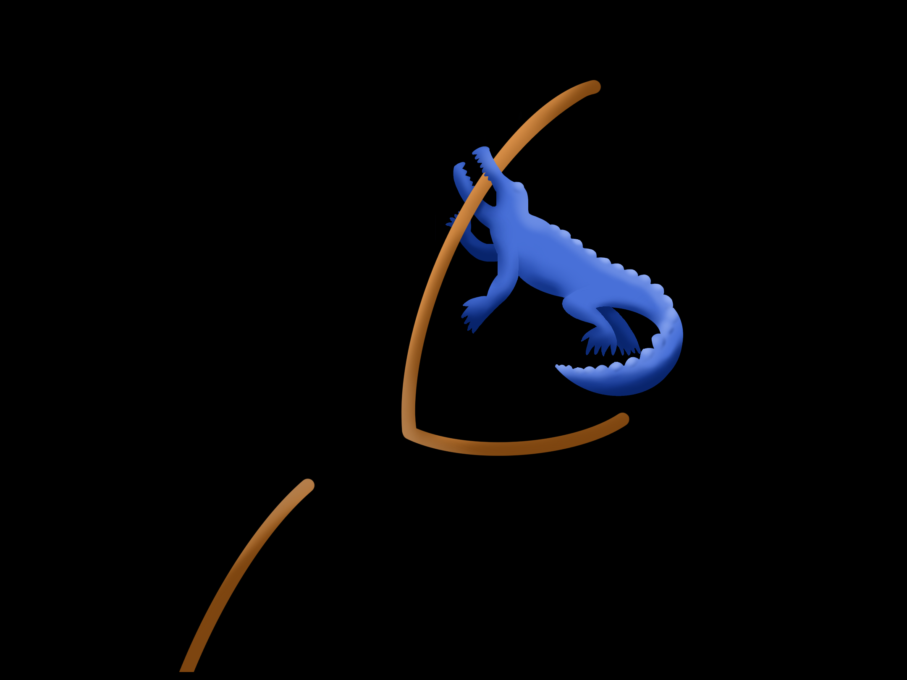

# cavendish-particle-tracks

<!---

-->
----------------------------------

A Napari plugin to perform a simple particle tracking analysis for the Cavendish laboratory's Undergraduate Part II Particle Tracks experiment.

----------------------------------

## Installation

Firstly, you'll need to [install napari](https://napari.org/stable/tutorials/fundamentals/installation.html) following their latest instructions.

Then you can install this plugin with:

    python -m pip install git+https://github.com/palvarezc/cavendish-particle-tracks.git

> [!NOTE]
> On macOS we've found it easier to install napari through `conda-forge` (the napari docs give instructions for this under the **'From conda-forge using conda'** tab.)
> The Cavendish Particle tracks plugin can still be installed via `pip`, from inside your `conda` environment.

## Getting started

**TODO** put some instructions with screenshots here.
The user manual can be found [here](https://palvarezc.github.io/cavendish-particle-tracks/user-manual.html).

## License

Distributed under the terms of the [MIT] license,
"cavendish-particle-tracks" is free and open source software

## Issues

If you encounter any problems, please [file an issue] along with a detailed description.

[napari]: https://github.com/napari/napari
[Cookiecutter]: https://github.com/audreyr/cookiecutter
[MIT]: http://opensource.org/licenses/MIT
[BSD-3]: http://opensource.org/licenses/BSD-3-Clause
[GNU GPL v3.0]: http://www.gnu.org/licenses/gpl-3.0.txt
[GNU LGPL v3.0]: http://www.gnu.org/licenses/lgpl-3.0.txt
[Apache Software License 2.0]: http://www.apache.org/licenses/LICENSE-2.0
[Mozilla Public License 2.0]: https://www.mozilla.org/media/MPL/2.0/index.txt
[cookiecutter-napari-plugin]: https://github.com/napari/cookiecutter-napari-plugin
[file an issue]: https://github.com/samcunliffe/cavendish-particle-tracks/issues
[tox]: https://tox.readthedocs.io/en/latest/
[pip]: https://pypi.org/project/pip/
[PyPI]: https://pypi.org/
